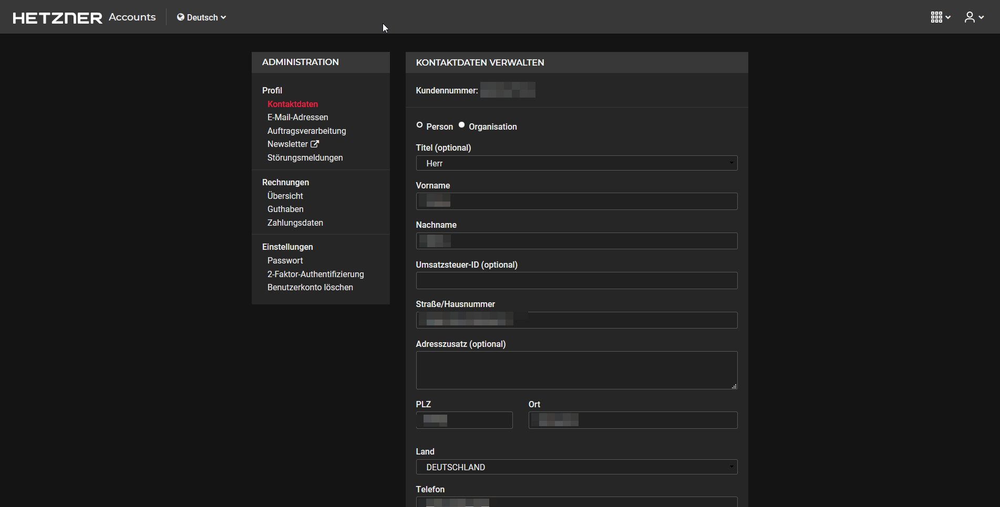

# hetzner-dark
Enables a dark style inspired by Hetzner Cloud Dark Mode for Hetzner Accounts

## Install as user style 

You need a userstyle manager like Stylus to install the userstyle. 

Available for [Firefox](https://addons.mozilla.org/de/firefox/addon/styl-us/), [Chrome](https://chrome.google.com/webstore/detail/stylus/clngdbkpkpeebahjckkjfobafhncgmne) and [Opera](https://addons.opera.com/de/extensions/details/stylus/). Also available on [GitHub](https://github.com/openstyles/stylus).
### Then download from [userstyles.org](https://userstyles.org/styles/182227/hetzner-accounts-dark-mode)

## Install as user script 
You need a user script manager like Tampermonkey to install the userstyle. 

Available for [Firefox](https://addons.mozilla.org/de/firefox/addon/tampermonkey/) and [Chrome](https://chrome.google.com/webstore/detail/tampermonkey/dhdgffkkebhmkfjojejmpbldmpobfkfo). Also available on [GitHub](https://github.com/Tampermonkey/tampermonkey).
### Then install from [GitHub](https://github.com/tobimori/hetzner-dark/raw/master/hetzner-dark.user.js)
